# Design Document

## Overview

This design extends the existing security scheme override mechanism to support API host URL customization for API key authentication. The implementation follows the established pattern used for OAuth2 overrides, ensuring consistency with the existing codebase architecture.

The feature enables users to specify a custom API host URL in the `security_scheme_overrides` field when creating or updating app configurations with `security_scheme=API_KEY`. During function execution, the REST function executor will use this custom host URL instead of the default `protocol_data.server_url`.

## Architecture

The implementation leverages the existing security scheme override infrastructure with minimal changes to the core architecture:

1. **Schema Layer**: Extend `SecuritySchemeOverrides` to include API key overrides
2. **Validation Layer**: Add validation for API key overrides in app configuration schemas
3. **Storage Layer**: Utilize existing encrypted storage for security scheme overrides
4. **Execution Layer**: Modify REST function executor to check for and apply host URL overrides
5. **Security Layer**: Integrate with existing security credentials manager for override retrieval

## Components and Interfaces

### 1. Schema Extensions

#### APIKeySchemeOverride Model
```python
class APIKeySchemeOverride(BaseModel):
    """
    Fields that are allowed to be overridden for API key authentication.
    """
    api_host_url: str = Field(
        ...,
        min_length=1,
        max_length=2048,
        description="Custom API host URL for white-labeling. Must include protocol (http/https)."
    )

    @field_validator("api_host_url")
    def validate_api_host_url(cls, v: str) -> str:
        if not (v.startswith("http://") or v.startswith("https://")):
            raise ValueError("API host URL must start with http:// or https://")
        return v.rstrip('/')  # Remove trailing slash for consistency
```

#### SecuritySchemeOverrides Extension
```python
class SecuritySchemeOverrides(BaseModel, extra="forbid"):
    """
    Allowed security scheme overrides
    """
    oauth2: OAuth2SchemeOverride | None = None
    api_key: APIKeySchemeOverride | None = None  # New field
```

### 2. Validation Logic

#### App Configuration Validation
Extend the existing validation in `AppConfigurationCreate` to handle API key overrides:

```python
@model_validator(mode="after")
def check_security_scheme_matches_override(self) -> "AppConfigurationCreate":
    if self.security_scheme_overrides.oauth2:
        if self.security_scheme != SecurityScheme.OAUTH2:
            raise ValueError(
                f"OAuth2 overrides not supported for security scheme {self.security_scheme}"
            )
    
    if self.security_scheme_overrides.api_key:
        if self.security_scheme != SecurityScheme.API_KEY:
            raise ValueError(
                f"API key overrides not supported for security scheme {self.security_scheme}"
            )
    
    return self
```

### 3. Security Credentials Manager Extension

#### Extended APIKeyScheme
Add optional api_host_url field to the existing APIKeyScheme:

```python
class APIKeyScheme(BaseModel):
    location: HttpLocation = Field(...)
    name: str = Field(...)
    prefix: str | None = Field(default=None, ...)
    api_host_url: str | None = Field(
        default=None,
        min_length=1,
        max_length=2048,
        description="Custom API host URL for white-labeling. If provided, overrides the default server URL."
    )

    @field_validator("api_host_url")
    def validate_api_host_url(cls, v: str | None) -> str | None:
        if v is None:
            return v
        if not (v.startswith("http://") or v.startswith("https://")):
            raise ValueError("API host URL must start with http:// or https://")
        return v.rstrip('/')  # Remove trailing slash for consistency
```

#### New Function: get_app_configuration_api_key_scheme
```python
def get_app_configuration_api_key_scheme(
    app: App, app_configuration: AppConfiguration
) -> APIKeyScheme:
    """
    Get the API key scheme for an app configuration, taking into account potential overrides.
    Similar to get_app_configuration_oauth2_scheme but for API key authentication.
    """
    api_key_scheme = APIKeyScheme.model_validate(app.security_schemes[SecurityScheme.API_KEY])
    
    # Parse the security scheme overrides
    security_scheme_overrides = SecuritySchemeOverrides.model_validate(
        app_configuration.security_scheme_overrides
    )
    
    # Apply api_key overrides if they exist
    if security_scheme_overrides.api_key:
        api_key_scheme = api_key_scheme.model_copy(
            update=security_scheme_overrides.api_key.model_dump(exclude_none=True)
        )
    
    return api_key_scheme
```

#### SecurityCredentialsResponse (unchanged)
The existing SecurityCredentialsResponse remains the same, with the scheme field containing the APIKeyScheme with potential overrides applied.

### 4. Function Executor Modifications

#### REST Function Executor URL Construction
Modify the `_execute` method in `RestFunctionExecutor` to check for api_host_url in the security scheme:

```python
@override
def _execute(
    self,
    function: Function,
    function_input: dict,
    security_scheme: TScheme,
    security_credentials: TCred,
) -> FunctionExecutionResult:
    # Extract parameters by location
    path: dict = function_input.get("path", {})
    query: dict = function_input.get("query", {})
    headers: dict = function_input.get("header", {})
    cookies: dict = function_input.get("cookie", {})
    body: dict = function_input.get("body", {})

    protocol_data = RestMetadata.model_validate(function.protocol_data)
    
    # Check if security scheme has api_host_url override (for API key schemes)
    if hasattr(security_scheme, 'api_host_url') and security_scheme.api_host_url:
        # Use custom host URL, preserving the path from protocol_data
        url = f"{security_scheme.api_host_url}{protocol_data.path}"
        logger.info(f"Using custom API host URL: {security_scheme.api_host_url}")
    else:
        # Use default URL construction
        url = f"{protocol_data.server_url}{protocol_data.path}"
    
    # ... rest of the method remains unchanged
```

### 5. Integration Points

#### Function Execution Flow
The existing `execute_function` in `routes/functions.py` requires minimal changes:

1. Retrieve security credentials response (unchanged)
2. The security credentials manager now returns an APIKeyScheme with potential overrides applied
3. Function executor receives the scheme with api_host_url populated if override exists
4. Function executor checks for api_host_url in the scheme during URL construction

#### Security Credentials Manager Integration
Modify `_get_api_key_credentials` to use the new `get_app_configuration_api_key_scheme` function:

```python
def _get_api_key_credentials(
    app: App, app_configuration: AppConfiguration, linked_account: LinkedAccount
) -> SecurityCredentialsResponse:
    """
    Get API key credentials from linked account or use app's default credentials.
    Now includes support for API host URL overrides.
    """
    security_credentials = (
        linked_account.security_credentials
        or app.default_security_credentials_by_scheme.get(linked_account.security_scheme)
    )

    if not security_credentials:
        logger.error(f"No API key credentials usable, app={app.name}")
        raise NoImplementationFound(f"No API key credentials usable for app={app.name}")

    # Get API key scheme with potential overrides applied
    api_key_scheme = get_app_configuration_api_key_scheme(app, app_configuration)

    return SecurityCredentialsResponse(
        scheme=api_key_scheme,  # Now includes api_host_url if overridden
        credentials=APIKeySchemeCredentials.model_validate(security_credentials),
        is_app_default_credentials=not bool(linked_account.security_credentials),
        is_updated=False,
    )
```

## Data Models

### Database Schema
No database schema changes required. The existing `app_configurations.security_scheme_overrides` JSONB field will store the new API key override data using the existing encryption mechanism.

### Data Flow

```mermaid
sequenceDiagram
    participant User
    participant API
    participant AppConfig
    participant SecurityMgr
    participant Executor
    participant ExternalAPI

    User->>API: Create/Update App Configuration with api_host_url
    API->>AppConfig: Validate and store security_scheme_overrides
    AppConfig->>AppConfig: Encrypt and persist override data
    
    User->>API: Execute Function
    API->>SecurityMgr: Get security credentials
    SecurityMgr->>SecurityMgr: Extract host URL override
    SecurityMgr->>API: Return credentials + host override
    API->>Executor: Execute with host override
    Executor->>Executor: Construct URL with custom host
    Executor->>ExternalAPI: Make request to custom host
    ExternalAPI->>Executor: Response
    Executor->>API: Function result
```


## Error Handling

### Validation Errors
- Invalid URL format: Return 400 with descriptive message
- URL too long: Return 400 with length limit information
- Wrong security scheme: Return 400 explaining scheme mismatch

### Runtime Errors
- Custom host unreachable: Log error, return 500 with connection details
- URL construction failure: Log error, fallback to default host with warning
- Malformed override data: Log error, use default configuration

### Logging Strategy
- Info level: Host URL selection decisions
- Warning level: Fallback to default host
- Error level: Connection failures, validation errors

## Testing Strategy

### Unit Tests
1. **Schema Validation Tests**
   - Valid API key override configurations
   - Invalid URL formats and edge cases
   - Security scheme mismatch scenarios

2. **Security Credentials Manager Tests**
   - Override extraction and application
   - Fallback behavior when no override present
   - Error handling for malformed override data

3. **Function Executor Tests**
   - URL construction with and without overrides
   - Path preservation when using custom hosts
   - Error handling for unreachable custom hosts

### Integration Tests
1. **End-to-End Function Execution**
   - Create app configuration with API key override
   - Execute function and verify custom host usage
   - Update override and verify change takes effect

2. **Security and Encryption**
   - Verify override data is encrypted in database
   - Test override data retrieval and decryption
   - Validate sensitive data is not exposed in logs

### Performance Considerations
- URL construction overhead: Minimal impact, simple string operations
- Override lookup: Leverages existing encrypted field access
- No additional database queries required

## Security Considerations

### Data Protection
- Host URL overrides stored using existing encryption mechanism
- No sensitive data exposed in API responses or logs
- Validation prevents injection attacks through URL manipulation

### Access Control
- Override configuration requires same permissions as app configuration
- No additional privilege escalation vectors introduced
- Existing RBAC model applies to override functionality

### Network Security
- Custom hosts must use HTTPS in production environments
- No automatic trust of custom certificates
- Standard HTTP client security practices apply