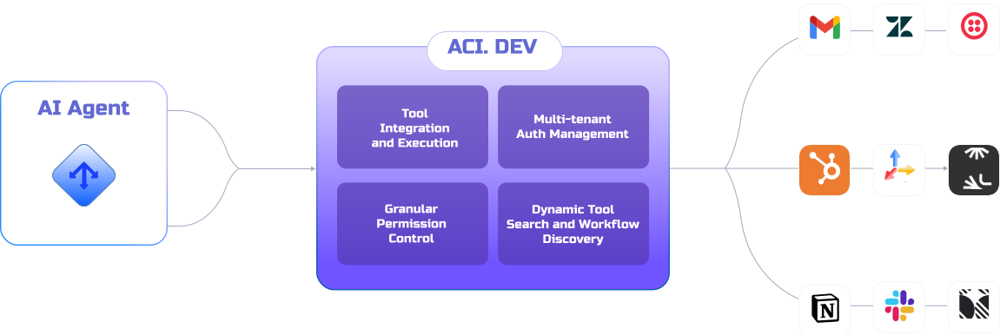

<p align="center">
  
</p>

# ACI: Open Source Tool-Use Infrastructure for AI Agents

<p align="center">
  <a href="https://github.com/aipotheosis-labs/aci/actions/workflows/ci.yml"></a>
  <a href="https://opensource.org/licenses/Apache-2.0"></a>
  <a href="https://discord.com/invite/UU2XAnfHJh"></a>
  <a href="https://x.com/AipoLabs"></a>
  <a href="https://badge.fury.io/py/aci-sdk"></a>
</p>

ACI.dev connects your AI agents to 600+ tool integrations with multi-tenant authentication, granular permissions, and dynamic tool discovery, accessible through either direct tool/function-calling or a unified MCP server.

**Example:** Instead of writing separate OAuth flows and API clients for Google Calendar, Slack, and more, use ACI.dev to manage authentication and provide your AI agents with unified, secure function calls. Access these capabilities through our lightweight [Python SDK](https://github.com/aipotheosis-labs/aci-python-sdk) or via our unified [MCP server](https://github.com/aipotheosis-labs/aci-mcp), compatible with any LLM framework.

Build production-ready AI agents without the infrastructure headaches.



## Key Features

- **600+ Pre-built Integrations**: Connect to popular services and apps in minutes.
- **Flexible Access Methods**: Use our lightweight SDK for direct function calling or our unified MCP server.
- **Multi-tenant Authentication**: Built-in OAuth flows and secrets management for both developers and end-users.
- **Enhanced Agent Reliability**: Natural language permission boundaries and dynamic tool discovery.
- **Framework & Model Agnostic**: Works with any LLM framework and agent architecture.
- **100% Open Source**: Everything released under Apache 2.0 (backend, dev portal, integrations).

## Quick Links

-   **Managed Service:** [aci.dev](https://www.aci.dev/)
-   **Documentation:** [aci.dev/docs](https://www.aci.dev/docs)
-   **Available Tools List:** [aci.dev/tools](https://www.aci.dev/tools)
-   **Python SDK:** [github.com/aipotheosis-labs/aci-python-sdk](https://github.com/aipotheosis-labs/aci-python-sdk)
-   **Unified MCP Server:** [github.com/aipotheosis-labs/aci-mcp](https://github.com/aipotheosis-labs/aci-mcp)
-   **Blog:** [aci.dev/blog](https://www.aci.dev/blog)
-   **Community:** [Discord](https://discord.com/invite/UU2XAnfHJh) | [Twitter/X](https://x.com/AipoLabs) | [LinkedIn](https://www.linkedin.com/company/aipotheosis-labs-aipolabs/posts/?feedView=all)

## Why Use ACI.dev?

ACI.dev solves your critical infrastructure challenges for production-ready AI agents:

- **Authentication at Scale**: Connect multiple users to multiple services securely.
- **Discovery Without Overload**: Find and use the right tools without overwhelming LLM context windows.
- **Natural Language Permissions**: Control agent capabilities with human-readable boundaries.
- **Build Once, Run Anywhere**: No vendor lock-in with our open source, framework-agnostic approach.

## Common Use Cases

*   **Personal Assistant Chatbots:** Build chatbots that can search the web, manage calendars, send emails, interact with SaaS tools, etc.
*   **Research Agent:** Conducts research on specific topics and syncs results to other apps (e.g., Notion, Google Sheets).
*   **Outbound Sales Agent:** Automates lead generation, email outreach, and CRM updates.
*   **Customer Support Agent:** Provides answers, manages tickets, and performs actions based on customer queries.

---

## Repository Structure

This is a monorepo that contains the core components of ACI.dev:

-   **`/backend`**: Contains the main ACI platform server, including the APIs, core logic, database models, and the entire integration library (over 600+ tools). It relies on Python, FastAPI, PostgreSQL (with pgvector), and Docker.
-   **`/frontend`**: Contains the Next.js application for the ACI.dev Developer Portal. This is the web interface for managing projects, integrations, authentication, and testing agents. It uses React, TypeScript, Tailwind CSS, and interacts with the backend API.

---

## Getting Started: Local Development

To run the full ACI.dev platform (backend server and frontend portal) locally, follow these steps:

### Prerequisites

-   **Git:** To clone the repository.
-   **Docker & Docker Compose:** To run the backend services (server, database, localstack).
-   **Python:** Version 3.12 or higher (primarily for development tooling like linters, if not using Docker exclusively).
-   **uv:** Python package manager (`pip install uv`). Used for managing backend Python dependencies.
-   **Node.js & npm:** To run the frontend developer portal (check `frontend/package.json` for specific version requirements, likely latest LTS).
-   **(Optional) ngrok:** If you need to test PropelAuth webhooks for user signups locally.

### 1. Backend Setup

1.  **Navigate to the backend directory:**
    ```bash
    cd backend
    ```
2.  **Install Python dependencies (optional, recommended for IDE integration):**
    ```bash
    uv sync
    # Activate virtual environment (optional)
    source .venv/bin/activate
    ```
3.  **Set up environment variables:**
    Copy `.env.example` to `.env`. Most necessary variables are pre-filled in `.env.shared`, but you might need to add specific secrets like `SERVER_PROPELAUTH_API_KEY` or `SERVER_SVIX_SIGNING_SECRET` if testing webhooks (see `backend/README.md` for details).
4.  **Start backend services:**
    ```bash
    docker compose up --build
    ```
    This will start the ACI server (port 8000), PostgreSQL database, and a LocalStack container (for mocking AWS services).

    *   The API documentation (Swagger UI) will be available at `http://localhost:8000/v1/notforhuman-docs`.
    *   See `backend/README.md` for optional steps like seeding the database or running tests.

### 2. Frontend Setup

1.  **Navigate to the frontend directory:**
    ```bash
    cd ../frontend # Or from the root: cd frontend
    ```
2.  **Install Node.js dependencies:**
    ```bash
    npm install --legacy-peer-deps
    ```
    *(Note: The `--legacy-peer-deps` flag might be needed due to ongoing React 19 adoption by libraries, as mentioned in `frontend/README.md`).*
3.  **Set up environment variables:**
    Create a `.env` file in the `frontend` directory with the following content:
    ```env
    NEXT_PUBLIC_API_URL=http://localhost:8000
    NEXT_PUBLIC_DEV_PORTAL_URL=http://localhost:3000
    NEXT_PUBLIC_ENVIRONMENT=local
    NEXT_PUBLIC_AUTH_URL=https://217353629.propelauthtest.com
    ```
    *(Adjust `NEXT_PUBLIC_API_URL` if your backend runs on a different port).*
4.  **Start the frontend development server:**
    ```bash
    npm run dev
    ```
    The Developer Portal should now be accessible at `http://localhost:3000`.

### 3. Further Details

For more in-depth information, including advanced configuration (like webhook setup), coding standards, testing, database migrations, and deployment details, please refer to the specific README files:

-   **Backend:** `backend/README.md`
-   **Frontend:** `frontend/README.md`

---

## Tech Stack

-   **Backend:**
    -   **Language:** Python 3.12+
    -   **Framework:** FastAPI
    -   **Database:** PostgreSQL with the `pgvector` extension (for vector similarity search)
    -   **ORM:** SQLAlchemy with Alembic for migrations
    -   **Dependency Management:** uv
    -   **Testing:** Pytest
    -   **Linting/Formatting:** Ruff, MyPy
-   **Frontend:**
    -   **Framework:** Next.js (using App Router)
    -   **Language:** TypeScript
    -   **UI Library:** React 19
    -   **Styling:** Tailwind CSS
    -   **Component Library:** shadcn/ui
    -   **Package Manager:** npm
    -   **Testing:** Vitest
    -   **Linting/Formatting:** ESLint, Prettier
-   **Authentication:** PropelAuth (Handles user login, sign-up, and organization management)
-   **Infrastructure:**
    -   **Containerization:** Docker & Docker Compose
    -   **Local AWS Mocking:** LocalStack (for services like Secrets Manager)

---
